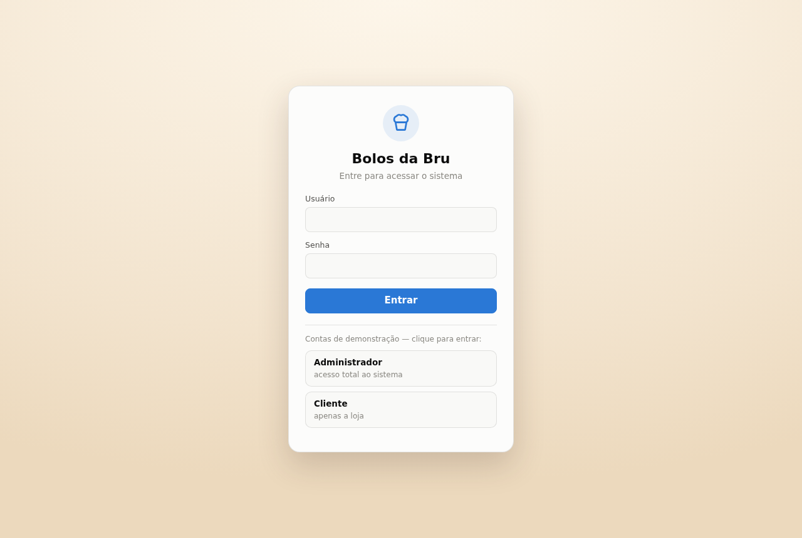
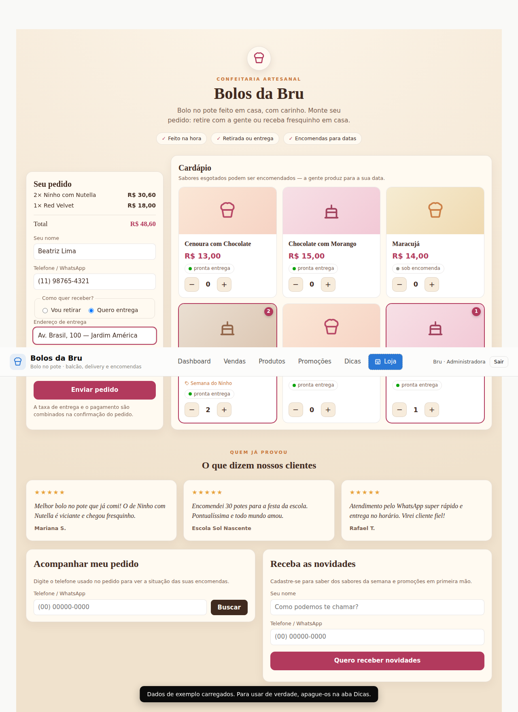
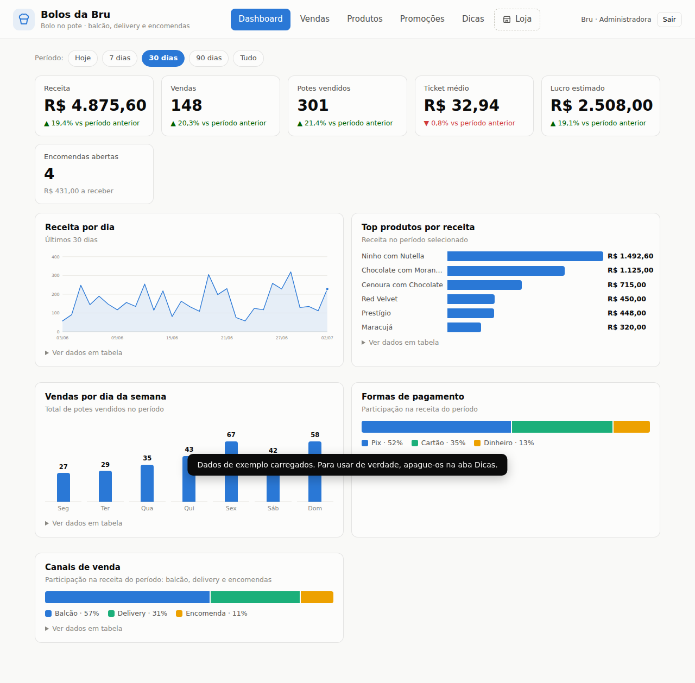
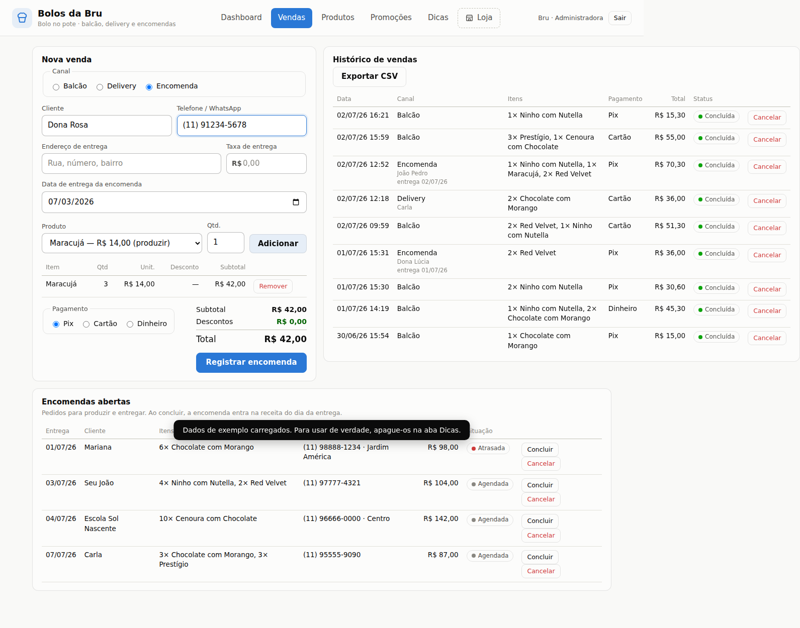

# Bolos da Bru — Gestão de vendas de bolo no pote

[](https://github.com/ghansengoncalves/bolos-da-bru/actions/workflows/tests.yml)

Sistema web completo para o dia a dia de uma loja de bolo no pote: dashboard
com indicadores, vendas de **balcão**, **delivery** (com taxa de entrega) e
**encomendas** (produção para data marcada), catálogo com controle de estoque,
promoções aplicadas automaticamente, uma **Loja on-line** onde o cliente monta
o próprio pedido e dicas geradas a partir dos dados reais do negócio.

## Acesso

O login é real, validado pelo servidor (ver [`server/`](server/README.md)):
senha com hash, sessão por JWT. Não há mais usuário/senha fixos no código.

- **Administradora**: usuário e senha definidos nas variáveis de ambiente do
  backend (`ADMIN_USERNAME`/`ADMIN_PASSWORD`) — vê todo o sistema (dashboard,
  vendas, produtos, promoções, dicas e loja).
- **Cliente**: cria conta com nome, e-mail e telefone na própria tela de
  login (ou entra por e-mail/telefone se já tiver conta) — vê só a **Loja**.
- **Visitante sem conta**: pode navegar e fazer encomendas na Loja sem se
  cadastrar, botão "Continuar sem conta".

## Como usar

Este sistema tem duas partes que precisam estar rodando: a **API**
(`server/`, com Postgres) e este **frontend** (arquivos estáticos).

```bash
# 1. Backend — ver instruções completas em server/README.md
cd server && npm install && cp .env.example .env  # edite o .env
npm start   # sobe em http://127.0.0.1:3000

# 2. Frontend (noutro terminal, na raiz do repo)
npm start   # sobe em http://127.0.0.1:4173
```

Se a API estiver noutro endereço (ex.: publicada na Render), ajuste a única
linha de configuração em `js/config.js`.

## Telas

| Login (dois perfis) | Loja — vitrine do cliente |
|---|---|
|  |  |

| Dashboard (painel da administradora) | Vendas e encomendas |
|---|---|
|  |  |

O painel administrativo é enxuto e focado em dados; a **Loja** tem identidade
própria de confeitaria (tons quentes, tipografia serifada, cardápio ilustrado,
depoimentos, acompanhamento de pedido e cadastro para novidades). O tema escuro
segue a preferência do sistema: [ver dashboard escuro](docs/screenshots/dashboard-dark.png).

## Funcionalidades

### Dashboard
- KPIs do período (receita, vendas, potes, ticket médio, lucro estimado) com
  comparação contra o período anterior, mais o total de encomendas abertas.
- Filtro de período (hoje / 7 / 30 / 90 dias / tudo) que re-escopa tudo.
- Cinco gráficos interativos com tooltip e visão em tabela: receita por dia,
  top produtos, dia da semana, formas de pagamento e canais de venda.
- Modo claro/escuro automático.

### Vendas (balcão, delivery e encomenda)
- Carrinho com múltiplos itens e promoções aplicadas automaticamente.
- **Balcão**: venda direta, baixa o estoque na hora.
- **Delivery**: cliente, endereço e taxa de entrega somada ao total (a taxa
  não entra no lucro — assume-se que cobre o deslocamento).
- **Encomenda**: cliente, contato e data de entrega. Não exige estoque pronto
  (produção sob demanda — dá até para encomendar sabor esgotado) e só vira
  receita quando concluída, no dia da entrega.
- Painel **Encomendas abertas** com status (atrasada / hoje / agendada),
  conclusão e cancelamento.
- Histórico completo com canal e cliente, cancelamento com estorno de estoque
  e exportação CSV (backup).

### Loja (visão do cliente)
- Cardápio com preços (e preços promocionais), pronta entrega ou sob encomenda.
- O cliente monta o pedido, escolhe retirada ou entrega e a data — o pedido
  entra direto em "Encomendas abertas".
- Botão "Enviar resumo no WhatsApp": com o número da loja salvo nas
  Configurações (aba Dicas), o resumo do pedido vai direto para o seu WhatsApp.

### Produtos e Promoções
- Cadastro com preço, custo, margem calculada e alertas de estoque.
- Promoções em % ou R$, por produto ou gerais, com vigência e status.

### Dicas
- Análises geradas dos seus dados: encomendas atrasadas, produção dos próximos
  dias, estoque esgotado/baixo, margens apertadas, sabores parados, melhores
  dias, ticket médio, Pix e delivery.
- Roteiro de evolução do sistema.

## Usando para vendas reais

Produtos, promoções e vendas ficam no Postgres do backend — não mais no
navegador. Qualquer dispositivo logado como administradora vê os mesmos
dados em tempo real, e um pedido feito na Loja pelo celular de uma cliente
já aparece direto no painel, sem depender de WhatsApp para "chegar".

- **Pedidos on-line continuam avisando por WhatsApp também** (conveniência,
  não a única forma de chegar): com o número da loja salvo em Dicas →
  Configurações, o botão "Enviar resumo no WhatsApp" manda a mensagem, mas o
  pedido já está em "Encomendas abertas" independente disso.
- **Backup**: exporte o CSV de vendas com frequência (aba Vendas).
- Ver [`server/README.md`](server/README.md) para como rodar o backend e
  fazer o deploy (inclui um `render.yaml` pronto para a Render).

### Hospedagem

O frontend estático continua podendo ficar no GitHub Pages (grátis, HTTPS):
Settings → Pages → Source: Deploy from a branch → `main`, pasta raiz. A API
precisa de um host que rode Node + Postgres — ver seção de deploy em
[`server/README.md`](server/README.md).

## Testes automatizados

Suíte E2E com [Playwright](https://playwright.dev), histórica de antes da
integração com o backend real (época em que o login era simulado e os dados
viviam só no navegador). Com a API real em uso, o fluxo de login mudou
(sem mais atalho de senha fixa) e vários testes precisam ser adaptados —
isso ainda não foi feito. Rodar a suíte hoje é útil para conferir que a UI
não regrediu estruturalmente, mas espere falhas nos testes de autenticação:

```bash
npm install
npx playwright install chromium   # primeira vez
npm test
```

O backend também tem sua própria suíte de testes (20 testes de integração,
sem depender da UI) — ver `server/README.md`.

## Tecnologia

Frontend: HTML, CSS e JavaScript puros — sem dependências de runtime, sem
build. Gráficos em SVG feitos à mão, paleta validada para daltonismo e
contraste. Fala com o backend via `fetch` (ver `js/config.js`).

Backend: Node.js/Express + Postgres (`server/`) — autenticação real e todas
as regras de negócio validadas no servidor.
